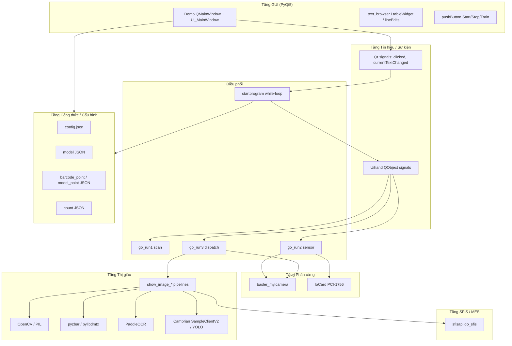

# Kiến trúc — SKY AOI

Thiết kế đơn file đơn khối: một class `Demo` sở hữu GUI, phần cứng, thị giác và MES.

## Tổng quan các tầng



## Mô tả các tầng

### Tầng GUI
- `Demo` kế thừa `QMainWindow` + `Ui_MainWindow` (từ module `UI` bên ngoài).
- Hiển thị log (`text_browser`), màu kết quả (`label_6`), trường SN/kết quả, lưới ảnh (`tableWidget`), bộ đếm.
- Thao tác người dùng: Bắt đầu/Dừng, chọn model, chọn route lưu, xóa đếm, combo ngôn ngữ/camera.

### Tầng Tín hiệu / Sự kiện
- **Kết nối Qt trực tiếp** (L357–364): nút → phương thức handler.
- **Cầu nối `Uihand`** (L365–370): tách vòng lặp `startprogram` chặn luồng khỏi các slot qua `pyqtSignal`:
  - `test1` → `go_run1`
  - `test2` → `go_run2`
  - `test3` → `go_run3`
  - `textbox` → `get_rightnow`
  - `clear_show` → `clear_showing`

### Tầng Camera
- Khám phá lúc khởi tạo: `self.mycamera = camera()` → `search_get_device()` (L209–219); **không đóng khi thoát**.
- Chụp lúc runtime: `self.ekkoshan = camera()` trong `startprogram` (L662) → `get_image()` (L816+).
- Tháo gỡ: `close_camera()` chỉ trên `ekkoshan` — `stopprogram` / `closeEvent`.
- `change_camera` là stub — chọn combo không có tác dụng.

### Tầng IO / Sensor
- Chỉ khi `is_sensor=True` (từ JSON model).
- `IoCard(...)` L673 — **import đã comment** L29; cần `profile/pci1756.xml`.
- `go_run2` poll DIO; thị giác **hardcode** thành `show_image_MR6500` L829.
- Pipeline nhiều bước / Cambrian cần chế độ thủ công (`go_run3`).

### Tầng Thị giác
- Hàm theo model: `show_image_MR6500`, `show_image_SKY`, `show_image_HH4K`, `show_image_C1000_8FP_E_2G_L`, v.v.
- Helper dùng chung: `get_inference_result` (Cambrian), `cambrian_space`, `yolov5_inference` (chết), `HH4K_compare`, `pHash`/`cmHash`, `UI_show`.
- OCR: PaddleOCR (SKY BƯỚC 3, Cisco, Nanook) — thường trên luồng UI.
- Barcode: pyzbar, pylibdmtx (`ReadDataMatrixCode`).
- ROI từ JSON công thức + `point/*.json` hardcode; scratch runtime dưới `source/`.
- **`cambrian_is_open=False` → hầu hết pipeline vẫn gọi `self.client`** (Nanook ngoại lệ một phần).

### Tầng SFIS / MES
- Tùy chọn (`sfis_choose` từ `config.json`).
- Khởi tạo: kết nối + đăng nhập trong `__init__` (L166–201); **`mysfis` không được tạo khi SFIS tắt**.
- API runtime: `get_sfis_SN`, `get_sfis_90`, `check_route`, `repair_SN`, `data_upload`.
- **MR6500 gọi SFIS không có guard `sfis_choose`** — crash khi SFIS tắt.
- Xem `07_camera_io_sfis.md` cho ma trận SFIS theo pipeline.

### Tầng Công thức / Cấu hình Model
- **`config.json`**: cài đặt SFIS, `choose_model`, `choose_route`.
- **JSON model** (file đã chọn): tên `model`, `camera_id`, `cambrian`, `path_json`, `count_json`, cờ sensor.
- **JSON điểm**: `barcode_point`, `model_point` — dạng shapes kiểu LabelMe.
- **Hằng số cấp module** (L53–112): chuỗi OCR/nhãn hardcode cho các biến thể Cisco.
- **Thư mục runtime:** `log/`, `source/`, `{choose_route}/{date}/` — xem `07_camera_io_sfis.md`.

## Luồng dữ liệu (một lần kiểm tra)

```text
Model JSON → select_model + ROI JSON
     ↓
Kích hoạt Sensor/Thủ công → get_image() → numpy BGR
     ↓
show_image_<MODEL> → crop ROI → barcode/OCR/AI/so sánh
     ↓
cờ stepN + Đạt/Không đạt → updatecount + resultcolor + lưu JPG
     ↓
[tùy chọn] mysfis.data_upload(sn, data, error=...)
     ↓
wait_test=True → vòng lặp startprogram chờ DUT tiếp theo
```

## Đặc điểm kiến trúc

| Đặc điểm | Nhận xét |
|----------|----------|
| Ghép nối | Rất cao — tất cả tầng trong một class |
| Mở rộng | Sản phẩm mới = `elif` mới trong `go_run3` + `show_image_*` mới |
| Khả năng kiểm thử | Thấp — phần cứng và GUI gắn chặt |
| Đồng thời | Tối thiểu — luồng UI chặn; OCR dùng QThread chỉ trên nhánh C1000 |
