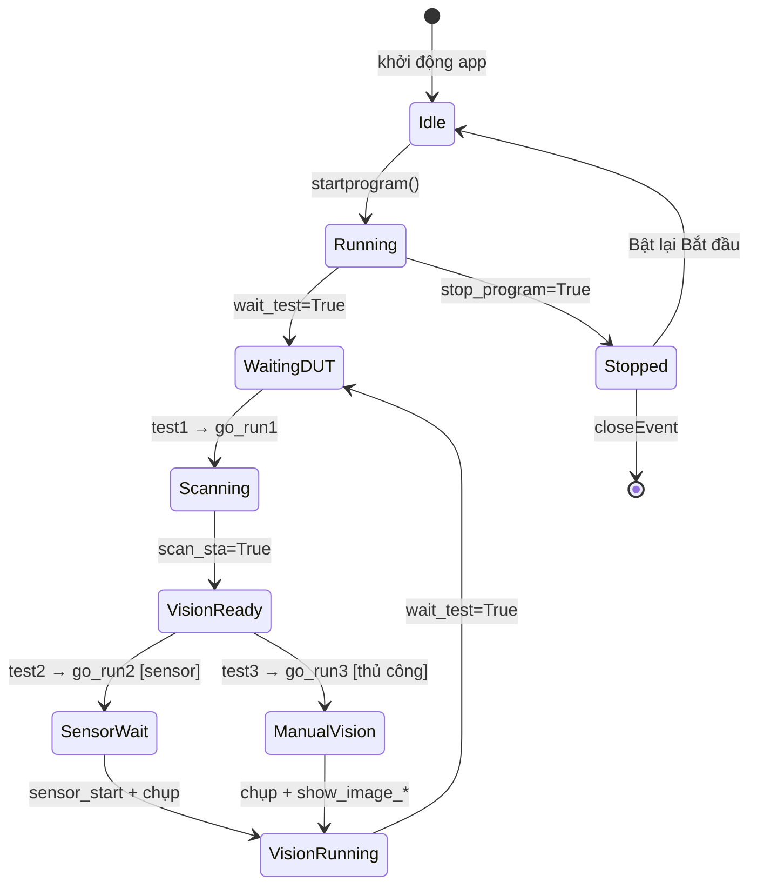

# Máy trạng thái

Không có class máy trạng thái chính thức. Hành vi runtime được điều khiển bởi **cờ boolean** và chuỗi **`select_model`** trên `Demo`.

## Sơ đồ trạng thái (khái niệm)

---

## wait_test

- **Mục đích:** Cổng kiểm tra trong `startprogram` — khi `True`, vòng lặp có thể bắt đầu chu kỳ DUT mới (emit `test1`).
- **Được đặt tại:**
  - Khởi tạo `startprogram` → `True` (L665)
  - Cuối đường dẫn kiểm thử thành công/thất bại trong `go_run2/3` → `True` (nhiều dòng, ví dụ L830, L969, L1133)
  - Người dùng hủy quét → `True` (L780)
  - Nhánh QMessageBox thoát người dùng → `True` (ví dụ L1158, L1290)
- **Được đọc tại:**
  - Vòng lặp `while` trong `startprogram`: `if self.wait_test and not stop_program` (L688, L704)
  - `go_run2`: kết hợp với trạng thái sensor (L802, L809, L831)
- **Ảnh hưởng luồng:** `False` trong lúc kiểm thử đang chạy; `True` cho phép chu kỳ tiếp theo.
- **Rủi ro:** Không luôn được đặt lại trên đường dẫn ngoại lệ; không nhất quán nếu thị giác ném exception.

---

## scan_sta

- **Mục đích:** Báo hiệu giai đoạn quét nhãn hoàn tất; kích hoạt `go_run2` hoặc `go_run3`.
- **Được đặt tại:**
  - Khởi tạo `startprogram` → `False` (L666)
  - `go_run1` thành công → `True` (L775, L792 bypass)
- **Được đọc tại:**
  - `startprogram`: `if self.scan_sta` → emit test2/test3 (L693, L716)
- **Được đặt lại tại:**
  - Sau khi emit test2/test3 → `False` (L696, L719)
- **Ảnh hưởng luồng:** Nối bước quét với bước chụp/thị giác.
- **Rủi ro:** Nếu `go_run1` đặt `scan_sta=False` ngầm qua hủy, vòng lặp có thể treo cho đến khi Dừng.

---

## stop_program

- **Mục đích:** Thoát vòng lặp `while` trong `startprogram` và các vòng poll bên trong.
- **Được đặt tại:**
  - Khởi tạo `startprogram` → `False` (L667)
  - `stopprogram()` → `True` (L5399)
  - `closeEvent()` → `True` (L5412)
  - Người dùng hủy quét trong `go_run1` → `True` (L781)
  - Các nhánh QMessageBox "thoát" trong `go_run3` (ví dụ L1159, L1291)
- **Được đọc tại:**
  - Tất cả vòng lặp `while True` / `while not stop_program` (L688, L703, L796)
- **Ảnh hưởng luồng:** Thoát vòng lặp; bật lại nút Bắt đầu (L699, L725).
- **Rủi ro:** `stopprogram` không ép thoát nếu bị chặn trong dialog modal hoặc `time.sleep(5)` dài trong `go_run2`.

---

## step1 – step6

- **Mục đích:** Cờ tiến độ kiểm thử nhiều bước; được đặt **bên trong** các hàm `show_image_*`; được đọc trong `go_run3` để nối chuỗi hộp thoại QMessageBox "BƯỚC N".
- **Được đặt tại:** Hàm thị giác (ví dụ `show_image_SKY`, `show_image_HH4K`) — thường `self.stepN = True/False` theo kết quả kiểm tra.
- **Được đọc tại:** Nhánh `go_run3` sau mỗi lần gọi `show_image_*` (ví dụ L994, L1074, L1333).
- **Được đặt lại tại:** Đầu mỗi nhánh model trong `go_run3` (ví dụ L972–975, L1035–1040).
- **Ảnh hưởng luồng:** Cổng kiểm tra tuần tự cho kiểm thử nhiều ảnh (SKY: 6 bước, HH4K: 4, Cisco: 2, v.v.).
- **Rủi ro:** Tác dụng phụ từ thị giác sang điều phối — ghép nối chặt; dễ lệch đồng bộ nếu hàm thị giác quên đặt cờ.

---

## Trạng thái UI Đạt / Không đạt

- **Mục đích:** Phản hồi cho người vận hành và thống kê.
- **Thành phần:**
  - `resultcolor("Pass"|"Fail"|"Waiting")` → màu `label_6` (L584–592)
  - Văn bản kết quả `lineEdit_9`
  - `updatecount()` → Tổng/Đạt/Không đạt/Tỷ lệ + lưu JSON
- **Được đặt tại:** Hàm thị giác và một số nhánh thất bại trong `go_run3`.
- **Không phải một cờ duy nhất** — suy ra từ kết quả bước và chuỗi suy luận.

---

## Trạng thái Sensor (IO)

- **Mục đích:** Phát hiện DUT qua DIO.
- **Biến:** `sensor_no`, `sensor_start` (từ JSON model); `mysta[0]` từ `iocard.get_io_signal()`.
- **Được đọc tại:** Vòng lặp `go_run2` (L797–832):
  - `sensor_no` + `wait_test=False` → tiếp tục chờ
  - `sensor_start` + `wait_test=False` → chụp ảnh, gọi thị giác, `wait_test=True`
  - `sensor_no` + `wait_test=True` → thoát vòng poll
- **Rủi ro:** Busy-poll chỉ có `processEvents`; không debounce; `sleep(5)` cố định sau kích hoạt (L813).

---

## Trạng thái select_model

- **Mục đích:** Chọn toàn bộ pipeline thị giác và số bước.
- **Được đặt tại:** Nạp JSON model trong `__init__` hoặc `choose_model`.
- **Được đọc tại:** `go_run1` (Button_check), `go_run3` (phân phối chính), bên trong helper thị giác.
- **Giá trị (bằng chứng trong go_run3):** MR6500, ipex_check, HH4K, SKY, SKY_4G, biến thể Cisco, Button_check, WP_check, C9105AXW_E, Nanook.
- **Ảnh hưởng:** Một chuỗi điều khiển toàn bộ hành vi theo sản phẩm.

---

## Trạng thái SFIS

- **Mục đích:** Kết nối MES và cổng tải lên.
- **Biến:** `sfis_choose`, `self.mysfis`, `self.data` (mẫu CSV L155), `thissn` / `SN_8P`.
- **Không phải cờ vòng lặp** — tải lên tùy chọn sau đạt/không đạt trong đường dẫn thị giác/điều phối.

---

## Chế độ is_sensor

- **Mục đích:** Kích hoạt bằng sensor so với kích hoạt thủ công qua QMessageBox.
- **Được đặt tại:** JSON model `is_sensor` (mặc định `True` trong choose_model L465).
- **Ảnh hưởng:**
  - `True` → khởi tạo IoCard, `go_run2` sau quét
  - `False` → xác nhận QMessageBox, `go_run3` sau quét (L702–720)

---

# Giai đoạn 2 — Chuyển trạng thái điều phối

## Bảng chuyển trạng thái

| Trạng thái hiện tại | Kích hoạt | Hàm | Thay đổi cờ | Trạng thái tiếp theo | Rủi ro |
|---------------------|-----------|-----|-------------|----------------------|--------|
| Idle (Bắt đầu bật) | Người dùng nhấn Bắt đầu | `startprogram` | `wait_test=True`, `scan_sta=False`, `stop_program=False`; tắt Bắt đầu | Running / WaitingDUT | Luồng UI vào `while True` |
| WaitingDUT | `wait_test=True` trong vòng lặp | `startprogram` | `wait_test=False` | Scanning | — |
| Scanning | emit `test1` | `go_run1` | `scan_sta=True` (hoặc hủy → `stop_program=True`) | VisionReady hoặc Stopped | Hủy đặt cả hai cờ |
| VisionReady | `scan_sta=True` | `startprogram` | `scan_sta=False`; emit test2 hoặc test3 | SensorWait hoặc ManualVision | Log gây hiểu nhầm "NO DUT FOUND" L694 |
| SensorWait | emit `test2` | `go_run2` | poll IO; khi kích hoạt: chụp → thị giác → `wait_test=True` | WaitingDUT | Thị giác hardcode MR6500 |
| ManualVision | emit `test3` | `go_run3` | chụp + phân phối; thường `wait_test=True` ở cuối | WaitingDUT | Model không xác định / HH4K fail có thể không đặt `wait_test` |
| Running | Người dùng nhấn Dừng | `stopprogram` | `stop_program=True` | Stopping | Trễ nếu đang sleep/modal |
| Stopping | Vòng lặp thấy cờ | `startprogram` | Bật lại Bắt đầu; break | Idle | — |
| Bất kỳ | Người dùng đóng cửa sổ | `closeEvent` | `stop_program=True`; dọn IO/camera | — | Có thể treo nếu bị chặn trong vòng lặp |

## Vòng đời cờ (chỉ điều phối)

### wait_test

- **Đặt ban đầu:** `startprogram` L665 → `True`
- **Đặt False tại:** `startprogram` khi bắt đầu chu kỳ L690, L713; ngầm trong lúc kiểm thử đang chạy (điều kiện `go_run2` L802)
- **Đặt True tại:** Cuối `go_run2` L830; cuối hầu hết nhánh `go_run3`; đường dẫn hủy/thoát QMessageBox; hủy `go_run1` L780
- **Đọc tại:** `startprogram` L688/L704; `go_run2` L802, L809, L831
- **Rủi ro:** Nếu `go_run3` thoát mà không đặt `wait_test` (HH4K step1 fail L993+, `select_model` không xác định), vòng lặp ngoài treo với `wait_test=False`

### scan_sta

- **Đặt ban đầu:** `startprogram` L666 → `False`
- **Đặt True tại:** `go_run1` L775 (Button_check OK) hoặc L792 (bypass)
- **Đặt lại tại:** `startprogram` L696/L719 sau khi emit test2/test3
- **Đọc tại:** `startprogram` L693/L716 trước khi emit test2/test3
- **Rủi ro:** Nếu `go_run1` không chạy (từ chối thủ công trước khi chấp nhận L721), không cần quét; nếu hủy `go_run1`, `stop_program` thoát vòng lặp thay vì treo

### stop_program

- **Đặt ban đầu:** `startprogram` L667 → `False`
- **Đặt True tại:** `stopprogram` L5399; `closeEvent` L5412; hủy `go_run1` L781; nhánh thoát QMessageBox trong `go_run3` (ví dụ L1159, L1291)
- **Đọc tại:** Tất cả vòng lặp điều phối L688+, L796
- **Rủi ro:** Không được kiểm tra trong `time.sleep(5)` L813 hoặc bên trong dialog modal

### step1–step6

- **Đặt lại tại:** Đầu mỗi nhánh model trong `go_run3` (ví dụ L972–975, L1035–1040)
- **Đặt tại:** Bên trong `show_image_*` (tầng thị giác — không chi tiết trong Giai đoạn 2)
- **Đọc tại:** `go_run3` lồng `if self.stepN == True` để nối bước QMessageBox
- **Rủi ro:** Điều phối giả định thị giác luôn đặt cờ; HH4K không có handler `step1==False` trong `go_run3`

### pushButton_2 (nút Bắt đầu)

- **Tắt:** `startprogram` L668
- **Bật lại:** Break vòng lặp khi `stop_program` L699/L725; hủy thủ công L722 — **không** trong `stopprogram()` bản thân
