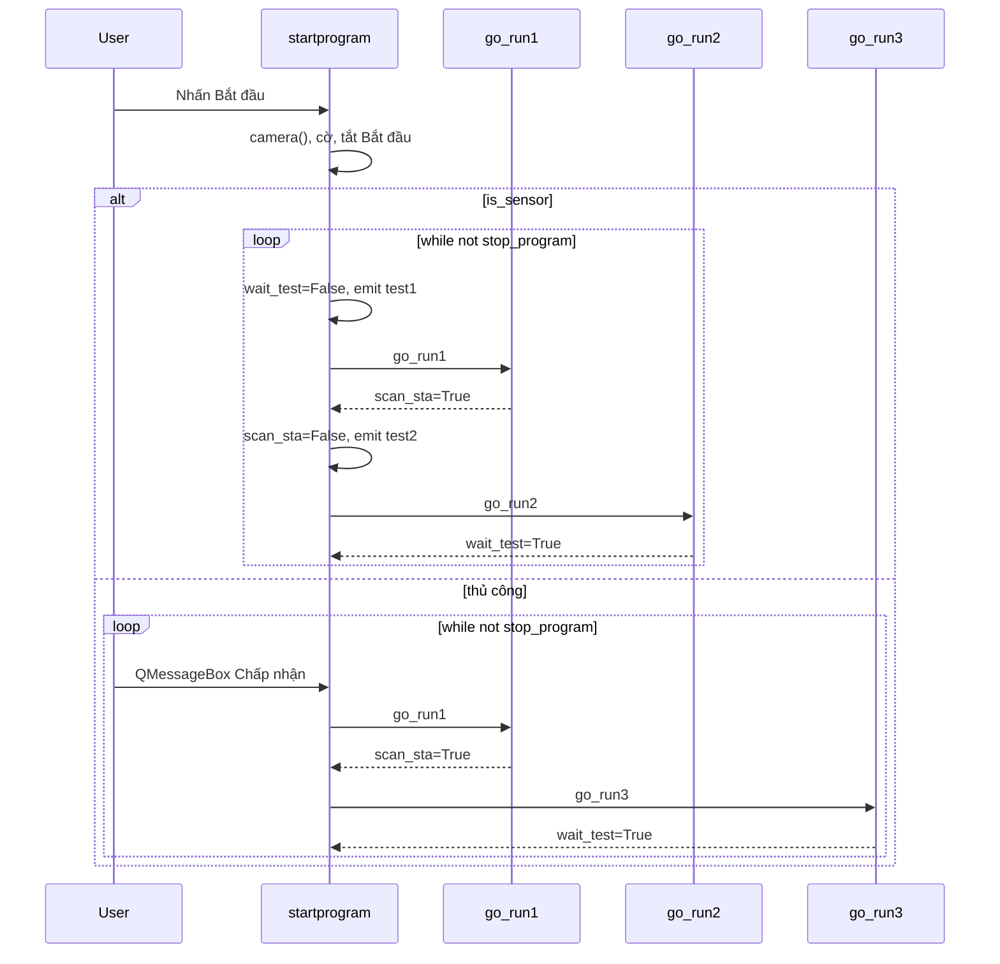
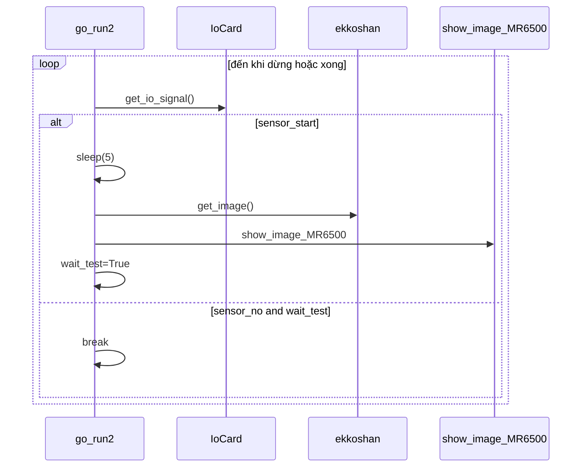

# Luồng runtime

Các đường dẫn thực thi từng bước suy ra từ `sky.py`.

## 1. Khởi động ứng dụng

```text
main (L5552)
  → QApplication
  → Demo.__init__ (L146)
      → create_log() — file dưới ./log/{todaytime}/
      → nạp config.json
      → [nếu SFIS bật] sfisapi.do_sfis + chuỗi loginout
      → camera().search_get_device() — điền comboBox_2; thoát nếu không có camera
      → [nếu choose_model] nạp JSON model, client Cambrian, JSON barcode/model/count
      → [nếu choose_route] đặt pciture_save, mkdir thư mục theo ngày
      → nối nút + tín hiệu Uihand
  → demo.show()
  → app.exec_() — vòng lặp sự kiện Qt (Idle)
```

## 2. Nạp cấu hình / Model (Người dùng hoặc lúc khởi động)

| Thao tác | Handler | Lưu trữ |
|----------|---------|---------|
| Chọn model (menu) | `choose_model()` L442 | Ghi `choose_model` vào config.json |
| Chọn route lưu | `choose_route()` L384 | Ghi `choose_route` vào config.json |
| Xóa bộ đếm | `clearcount()` L401 | Cập nhật count JSON |

JSON model cung cấp: `select_model`, camera, cấu hình Cambrian, đường dẫn ROI, cờ sensor, file đếm.

## 3. Người dùng nhấn Bắt đầu

`pushButton_2` → `startprogram()` (L660):

1. Tạo mới `self.ekkoshan = camera()`
2. Đặt `wait_test=True`, `scan_sta=False`, `stop_program=False`
3. Tắt nút Bắt đầu
4. Nếu `is_sensor`: khởi tạo `IoCard` (L673)
5. Vào **`while True`** (L687 sensor / L703 thủ công)

## 4. Chế độ thủ công (`is_sensor=False`)

```text
while True:
  if wait_test and not stop_program:
    QMessageBox "Please enter for test"
      Chấp nhận (16384):
        clear_show → wait_test=False → xóa bảng → emit test1 (go_run1)
        if scan_sta: emit test3 (go_run3) → scan_sta=False
      Từ chối (65536): break vòng lặp, bật lại Bắt đầu
  if stop_program: break
```

Chế độ thủ công bỏ qua `go_run2`; chụp ảnh nằm trong `go_run3`.

## 5. Chế độ sensor (`is_sensor=True`)

```text
while True:
  if wait_test and not stop_program:
    resultcolor("Waiting")
    wait_test=False → xóa bảng → emit test1 (go_run1)
    if scan_sta:
      emit test2 (go_run2) → scan_sta=False
  if stop_program: break
```

### go_run2 (L795)

```text
while not stop_program:
  mysta = iocard.get_io_signal()
  processEvents()
  if sensor_no and not wait_test: continue
  elif sensor_start and not wait_test:
    sleep(5)
    get_image() → show_image_MR6500()   ⚠ luôn MR6500
    wait_test=True
  elif sensor_no and wait_test: break
```

## 6. go_run1 — Giai đoạn quét (L736)

| select_model | Hành vi |
|--------------|---------|
| `Button_check` | Vòng lặp QInputDialog đến khi OK; đặt `scaninfo`, `scan_sta=True` |
| Khác | Log "Bypass Scan", `scan_sta=True` |

Hủy quét: `wait_test=True`, `stop_program=True`.

## 7. go_run3 — Phân phối thị giác (L834)

`QApplication.processEvents()` khi vào.

Nhánh theo `select_model`:

| Model | Tóm tắt luồng |
|-------|---------------|
| MR6500 | get_image → show_image_MR6500 |
| ipex_check | get_image → camera_check_ipex → analyse |
| HH4K | Tối đa 4× (QMessageBox BƯỚC N → chụp → show_image_HH4K) |
| SKY / SKY_4G | Chuỗi tối đa 6 bước → show_image_SKY |
| Cisco C1000/C1200/C1300 | 2 bước → show_image_C1000_8FP_E_2G_L |
| Button_check | BƯỚC 1 → show_image_Button_check |
| WP_check / C9105AXW_E | Tối đa 6× → show_image_WP |
| Nanook | Khởi tạo PaddleOCR; tối đa 6× → show_image_Nanook |

Mỗi bước: chụp → hàm thị giác đặt `stepN` → điều phối kiểm tra cờ → bước tiếp hoặc xử lý thất bại.

## 8. Chụp camera

- **Mở:** `startprogram` → `self.ekkoshan = camera()` (L662)
- **Chụp:** `ekko, shan = self.ekkoshan.get_image()` — dùng trong go_run2/3
- **Đóng:** `stopprogram` / `closeEvent` → `self.ekkoshan.close_camera()` (L5402, L5415)

Instance khám phá riêng `self.mycamera` từ init (L209) — không dùng để chụp trong lúc kiểm thử.

## 9. Phân phối thị giác → Đạt/Không đạt

Bên trong `show_image_*`:

- Crop ROI, chạy kiểm tra
- Đặt `self.stepN = True/False`
- `resultcolor`, `lineEdit_9`, `updatecount`
- Lưu JPG có chú thích dưới `pciture_save/{todaytime}/`
- `UI_show` cho tableWidget

## 10. Tải lên SFIS

- **Chỉ khởi tạo trong __init__** (kết nối/đăng nhập).
- **Tải lên:** `self.mysfis.data_upload(sn, self.data, error=...)` khi `sfis_choose==True`.
- Gọi từ nhánh đạt/không đạt trong `go_run3` (SKY, Cisco, v.v.) và bên trong `show_image_MR6500` (tra cứu SN).
- Không tập trung trong điều phối — rải rác trong thị giác + handler thất bại go_run3.

## 11. Dừng

`stopprogram()` (L5398):

- `stop_program = True`
- Thử: `iocard.instantDioCtrlDispose()`, `ekkoshan.close_camera()`
- **Không** tự break vòng lặp — phụ thuộc vòng lặp kiểm tra `stop_program`

Nút Bắt đầu bật lại khi vòng lặp break (L699, L725).

## 12. Đóng ứng dụng

`closeEvent` (L5411): dọn dẹp giống stop; đặt `stop_program=True`.

Nếu vòng lặp `while` của `startprogram` vẫn chạy trên luồng UI, đóng có thể chặn cho đến khi vòng lặp thấy cờ.

## Ghi chú thời gian

- **Sleep cố định 5 giây** sau kích hoạt sensor trước khi chụp (L813).
- Poll sensor: vòng lặp chặt + `processEvents()` — không sleep rõ ràng khi chờ.

---

# Giai đoạn 2 — Luồng điều phối chi tiết

## Hàm: startprogram (L660–729)

**Được gọi bởi:** `pushButton_2.clicked` (L363)

**Chuỗi khởi tạo:**
1. `self.ekkoshan = camera()` — instance chụp mới (L662)
2. Cờ: `wait_test=True`, `scan_sta=False`, `stop_program=False` (L665–667)
3. `pushButton_2.setEnabled(False)` (L668)
4. Nếu `is_sensor`: `IoCard(...)` PCI-1756 (L671–675)

**Quy tắc emit:**

| Chế độ | Điều kiện | Tín hiệu | Đích |
|--------|-----------|----------|------|
| Sensor | `wait_test` sau chuẩn bị chu kỳ | `test1` | `go_run1` |
| Sensor | `scan_sta` sau go_run1 | `test2` | `go_run2` |
| Thủ công | Người dùng chấp nhận QMessageBox + `scan_sta` | `test3` | `go_run3` |

**Break vòng lặp:** `stop_program==True` → bật Bắt đầu, `break` (L698–700, L724–726). Từ chối thủ công tại prompt → L721–723.

**Ngoại lệ:** L727–729 ghi log UI; không bật lại Bắt đầu nếu đã tắt trước ngoại lệ.

## Luồng chi tiết startprogram



## Luồng chi tiết chế độ thủ công

1. Vòng lặp ngoài chờ `wait_test=True` (L704)
2. Modal `QMessageBox.question` "Please enter for test" (L705)
3. Chấp nhận (16384): `clear_show` → `wait_test=False` → `test1` → `go_run1`
4. Nếu `scan_sta`: log → `scan_sta=False` → `test3` → `go_run3` (phân phối model đầy đủ)
5. Từ chối (65536): bật Bắt đầu, break vòng lặp
6. **Không có `go_run2`** trong chế độ thủ công — chụp chỉ trong `go_run3`

## Luồng chi tiết chế độ sensor

1. Giống thủ công cho `test1` / `go_run1` (L688–692)
2. Nếu `scan_sta`: emit `test2` → `go_run2` (L693–697)
3. `go_run2` poll sensor đến khi chụp xong hoặc dừng
4. **Không gọi `go_run3`** — thị giác chỉ trong `go_run2`

## Luồng chi tiết go_run1 (L736–792)

| select_model | Hành vi |
|--------------|---------|
| `Button_check` | `while True` + `QInputDialog` đến khi OK; đặt `scaninfo`, `scan_sta=True` |
| Tất cả khác | Log "Bypass Scan"; `scan_sta=True` ngay |

**Hủy quét:** L780–781 → `wait_test=True`, `stop_program=True` (thoát vòng lặp chính ở lần kiểm tra tiếp theo).

**Rủi ro vòng lặp vô hạn:** Dialog Button_check lặp đến khi Chấp nhận; Hủy thoát qua cờ — không vô hạn nếu người dùng hủy được.

## Luồng chi tiết go_run2 (L795–832)

- Poll `iocard.get_io_signal()` → `mysta[0]`
- `sensor_no` + `wait_test==False` → continue (DUT chưa sẵn sàng / đang chờ)
- `sensor_start` + `wait_test==False` → log, **`sleep(5)`**, `get_image()`, **`show_image_MR6500(shan)`**, `wait_test=True`
- `sensor_no` + `wait_test==True` → **break** (chu kỳ hoàn tất, trả về startprogram)

**sensor_no / sensor_start:** Từ JSON model (`sensor_no`, `sensor_start`); so sánh int với `mysta[0]`.

**Vấn đề hardcode:** L829 luôn `show_image_MR6500` — không kiểm tra `select_model`. Công thức không phải MR6500 chạy pipeline sai trong chế độ sensor.

**Thoát:** Break khi sensor trở về `sensor_no` sau kiểm thử; hoặc `stop_program` thoát điều kiện while.

## Phân phối go_run3 (chỉ điều phối)

Dispatcher chính L834–1911. Xem `08_model_dispatch.md` cho bảng đầy đủ.

**Vị trí Đạt/Không đạt:**

| Model | Đạt/Không đạt chủ yếu trong |
|-------|------------------------------|
| MR6500 | `show_image_MR6500` |
| ipex_check | `go_run3` L926–949 |
| HH4K | `show_image_HH4K` đặt stepN; chỉ đường dẫn thành công đặt `wait_test` |
| SKY/SKY_4G | Thị giác + handler fail `go_run3` (SFIS L1149+) |
| Biến thể Cisco | Thị giác + fail `go_run3` (SFIS `SN_8P`) |
| Button_check | Thị giác + fail `go_run3` L1425+ |
| WP / Nanook | Thị giác + handler fail `go_run3` (SFIS `thissn`) |

**Không có nhánh else** ở cuối `go_run3` — `select_model` không xác định trả về mà không đặt `wait_test=True` (rủi ro treo).

## Hành vi dừng/đóng

### stopprogram (L5398–5404)

- Chỉ đặt `stop_program=True`
- Try/except (bare pass): `iocard.instantDioCtrlDispose()`, `ekkoshan.close_camera()`
- **Không** bật lại Bắt đầu — vòng lặp phải break trước
- **Không** ngắt sleep(5) hoặc dialog modal

### closeEvent (L5411–5419)

- Dọn dẹp giống `stopprogram` + `print(123)`
- Cùng hạn chế: nếu bị chặn trong sleep `go_run2` hoặc QMessageBox, đóng có thể trễ

```mermaid
sequenceDiagram
    participant User
    participant Stop as stopprogram
    participant Loop as vòng lặp startprogram

    User->>Stop: Nhấn Dừng
    Stop->>Stop: stop_program=True, dọn IO/camera
    Note over Loop: Vòng lặp kiểm tra stop_program đầu mỗi lần lặp
    Loop->>Loop: bật Bắt đầu, break
```

## Sơ đồ trình tự runtime — Đường chụp sensor


