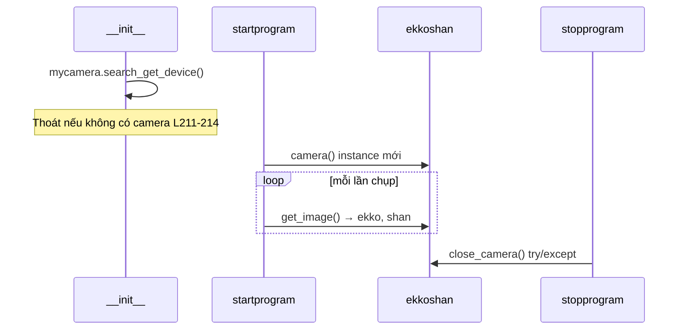

# Ranh giới Camera / IO / SFIS / Bên ngoài

Bản đồ ranh giới Giai đoạn 11 cho `sky.py` (~5.571 dòng). Chi tiết pipeline sản phẩm nằm trong docs `13`–`19`; tài liệu này bao phủ **phần cứng, MES, dịch vụ AI, tài sản và triển khai**.

**Thư mục làm việc:** `basicdir = os.getcwd()` L46 — mọi đường dẫn tương đối giải quyết từ CWD khi khởi chạy app.

---

## 1. Kiểm kê phụ thuộc bên ngoài

### Gói Python (import trong `sky.py`)

| Gói / module | Dòng | Vai trò |
|--------------|------|---------|
| `PyQt5` | L12–15 | GUI, tín hiệu, dialog, `QThread` |
| `UI.Ui_MainWindow` | L10 | Bố cục Qt Designer — **không có trong repo** |
| `basler_my.camera` | L28 | Wrapper chụp Basler — **không có trong repo** |
| `pypylon.pylon` | L27 | SDK Basler (import; dùng chính qua `basler_my`) |
| `sfisapi` | L11 | Wrapper SOAP SFIS/MES — **không có trong repo** |
| `pega_inference.v2.sample_client.SampleClientV2` | L23 | Client suy luận Cambrian |
| `cv2` (OpenCV) | L25 | Đọc/ghi ảnh, crop, vẽ, grayscale |
| `numpy` | L31 | Mảng |
| `PIL` | L32 | Hash/so sánh (`ImageChops`, `ImageStat`) |
| `pylibdmtx` | L30 | Giải mã DataMatrix (MR6500, WP_check) |
| `pyzbar` | L33 | Barcode 1D/2D (SKY, Cisco, Nanook, C9105AXW_E) |
| `paddleocr.PaddleOCR` | L34 | OCR (SKY BƯỚC 3, Cisco, Nanook) |
| `paddle` | L35 | Backend Paddle |
| `suds.client.Client` | L22 | SOAP (có thể dùng bên trong `sfisapi`) |
| `json`, `logging`, `ctypes`, `re`, `threading`, `Queue` | nhiều nơi | Cấu hình, log, MessageBox Win32, tiện ích |

### Module cục bộ — **import đã comment nhưng vẫn được tham chiếu**

| Module | Import | Dùng tại | Lỗi nếu thiếu |
|--------|--------|----------|----------------|
| `ioCardNew.IoCard` | L29 `#` | L673 `startprogram` chế độ sensor | `NameError: IoCard` |
| `ipex_check_yolo.camera_check_ipex` | L37 `#` | L871 `go_run3` ipex_check | `NameError` |
| `yolov5.classify.predict_change` | L7 `#` | L2540 `yolov5_inference` | `NameError` (nhánh hoạt động chết: chỉ `show_image_SKY_yolo`) |

### File / thư mục bắt buộc lúc runtime

| Đường dẫn | Mục đích |
|-----------|----------|
| `config.json` | Bật/tắt SFIS, thiết bị, đường dẫn model, route lưu |
| JSON model (từ `choose_model`) | `model`, `camera_id`, `cambrian`, `path_json`, `count_json`, cờ sensor |
| JSON `barcode_point` / `model_point` | Từ `path_json` model — ROI công thức |
| `point/*.json` | File ROI hardcode (SKY, HH4K, WP, Nanook, Button_check) |
| `sample/*.jpg` | Ảnh chuẩn (MR6500, HH4K, stub verify) |
| `source/` | Scratch runtime + trung gian OCR (**phải tồn tại / có quyền ghi**) |
| `source/8P/` | Lưu crop OCR Cisco |
| `log/{YYYYMMDD}/` | File log theo ngày |
| `{choose_route}/{YYYYMMDD}/` | Lưu trữ ảnh kiểm tra |
| `profile/pci1756.xml` | Profile thẻ IO Advantech L673 |
| `yolov5/classify/` | Trọng số YOLO `best.pt`, `best_4G.pt` (nhánh sản xuất chết) |
| Count JSON | Lưu trữ Đạt/Không đạt/Tỷ lệ theo model |

### Dịch vụ mạng / bên ngoài

| Dịch vụ | Khi cần |
|---------|---------|
| Endpoint SOAP SFIS | `config.json` → `sfisinfo.is_open == true` |
| Máy chủ suy luận Cambrian | JSON model → `cambrian.is_cambrian == true` |
| Tải model PaddleOCR | Lần dùng OCR đầu (có thể truy cập internet lần chạy đầu) |

---

## 2. Ranh giới Camera

### Hai instance `camera()`

| Instance | Tạo | Mục đích | Đóng |
|----------|-----|----------|------|
| `self.mycamera` | `__init__` L209 | `search_get_device()` → điền `comboBox_2`; xác thực `camera_id` trong JSON model | **Không bao giờ đóng rõ ràng** |
| `self.ekkoshan` | `startprogram` L662 (mỗi lần Bắt đầu) | `get_image()` trong `go_run2` / `go_run3` | `stopprogram` L5402, `closeEvent` L5415 |

### Vòng đời

### Điểm gọi chụp

| Vị trí | Dòng | Chế độ |
|--------|------|--------|
| `go_run2` | L816 | Sensor — sau `sleep(5)` |
| `go_run3` | L845, L865, L980+, L1058+, L1321+, L1410+, L1475+, L1708+, … | Thủ công — mỗi bước / model |

**Trả về:** `(ekko, shan)` — `shan` là khung BGR `numpy` truyền vào `show_image_*`.

### Xác thực cấu hình

- Khởi động: không có camera → MessageBox + `sys.exit()` L211–214.
- Nạp model: `modelinfo["camera_id"]` phải nằm trong `allcameras` L296–299.
- `change_camera` L606–607 là **stub** (`pass` qua `1`) — đổi combo không có tác dụng.

### Rủi ro

- `stopprogram` / `closeEvent` dùng `try/except` trần — lỗi dọn dẹp bị nuốt L5403–5404.
- `stop_program` không được kiểm tra trong `get_image()` hoặc `sleep(5)` L813 — Dừng trễ.
- Instance khám phá `mycamera` mở suốt vòng đời app.
- `cv2.imread("sample/...")` verify/debug nạp ở nhiều nhánh nhưng **đã comment** cho chụp sản xuất (trừ biến không dùng như SKY L1041–1046 vẫn nạp `source/1–6.jpg` vào bộ nhớ).

---

## 3. Ranh giới Thẻ IO / Sensor

### Kích hoạt

- JSON model `is_sensor` (mặc định `True` trong `choose_model` L465).
- `startprogram` L671–675: nếu `is_sensor`, `IoCard(deviceDescription="PCI-1756,BID#0", profilePath="profile\\pci1756.xml")`.

### Poll sensor (`go_run2` L795–832)

| Tín hiệu | Nguồn | Ý nghĩa |
|----------|-------|---------|
| `mysta[0]` | `iocard.get_io_signal()` L797 | Trạng thái DIO hiện tại |
| `sensor_no` | JSON model | DUT không có / chu kỳ hoàn tất |
| `sensor_start` | JSON model | DUT có — kích hoạt chụp |

**Logic:**

1. `sensor_no` + `wait_test==False` → tiếp tục poll.
2. `sensor_start` + `wait_test==False` → log, **`time.sleep(5)`**, `get_image()`, **`show_image_MR6500(shan)`** L829 — **luôn MR6500**, không phân phối `select_model`.
3. `sensor_no` + `wait_test==True` → break (trả về `startprogram`).

### Dọn dẹp

- `stopprogram` / `closeEvent`: `iocard.instantDioCtrlDispose()` trong try/except L5401, L5414.
- Nếu `is_sensor=False`, `iocard` không được tạo — dọn dẹp có thể `AttributeError` (đã bắt).

### Ghi chú ranh giới quan trọng

Chế độ sensor **không bao giờ gọi `go_run3`**. Mọi pipeline nhiều bước / Cambrian / OCR cần **chế độ thủ công** (`is_sensor=False`). Quét (`go_run1`) vẫn chạy cho Button_check trong chế độ sensor, nhưng thị giác chỉ MR6500.

---

## 4. Ranh giới SFIS / MES

### Khởi tạo (`__init__` L161–201)

| `sfisinfo.is_open` | Hành vi |
|--------------------|---------|
| `true` | `mysfis = sfisapi.do_sfis(url, deviceshow, opid)`; chuỗi đăng nhập `loginout("5"/"2"/"1")`; thất bại → MessageBox + `sys.exit()` |
| `false` | Log "SFIS Disable"; **`mysfis` không được tạo** |
| khác | MessageBox + `sys.exit()` |

**Cờ cổng:** `self.sfis_choose` = `config.json` → `sfisinfo.is_open` L161.

**Mẫu tải lên:** `self.data = '"TEST","STATUS","VALUE"\r\n'` L155.

### Ma trận dùng API SFIS

| API | Pipeline | Có guard `sfis_choose`? | Biến SN |
|-----|----------|-------------------------|---------|
| `get_sfis_SN` | MR6500 | **Không** L2032 | Từ ISN DataMatrix |
| `get_sfis_90` | MR6500, Cisco BƯỚC 1 | MR6500: **Không** L2035; Cisco: **Có** L3581+ | mbsn / barcode_list[n] |
| `check_route` | SKY, WP, Nanook, Button_check | **Có** | `thissn` / `scaninfo` |
| `repair_SN` | SKY, WP, Nanook, Button_check | **Có** (trong nhánh route-fail) | giống trên |
| `data_upload` (đạt) | SKY BƯỚC 6, Cisco BƯỚC 2, WP BƯỚC 6, Nanook BƯỚC 6, Button_check BƯỚC 1 | **Có** | `thissn` / `SN_8P` / `scaninfo` |
| `data_upload` (không đạt, `error=`) | handler go_run3 | **Có** | `thissn` / `SN_8P` / **lỗi `thissn` trên Button_check** |

### Pipeline **không có SFIS**

HH4K, ipex_check, MR6500 (chỉ truy vấn — **không có `data_upload`**).

### Crash / hành vi sai khi SFIS tắt (`sfis_choose=False`)

| Pipeline | Rủi ro |
|----------|--------|
| **MR6500** | **Vô điều kiện** `mysfis.get_sfis_SN` / `get_sfis_90` sau giải mã L2032–2035 → `AttributeError` |
| SKY / WP / Nanook / Button_check / Cisco | Khối SFIS có cổng — vẫn có đường offline Cambrian/barcode |
| Upload fail trong go_run3 | Bỏ qua khi `sfis_choose=False` |

### Mã lỗi (điều phối)

- SKY fail: `BDFA0` (không có `1` cuối)
- Cisco, WP, Nanook, Button_check fail: `BDFA01`

Khối upload trùng lặp trong `go_run3` — rủi ro bảo trì.

---

## 5. Ranh giới AI Cambrian

### Khởi tạo client (khối `cambrian` trong JSON model)

Khi `is_cambrian == true` (`__init__` L243–288, `choose_model` L469–515):

- `SampleClientV2(url, port, model_name, model_token [, model_weight, model_version])`
- Thăm dò `get_version()` — thất bại → MessageBox + `sys.exit()`
- Đặt `self.cambrian_is_open = True`, `self.client = ...`

Khi `is_cambrian == false`:

- `self.cambrian_is_open = False`
- **`self.client` không được tạo**

### Helper suy luận

| Helper | Dòng | Vai trò |
|--------|------|---------|
| `get_inference_result(img_list)` | L630–647 | `self.client.predict_images(img_list)` → danh sách `category_name` |
| `cambrian_space(result, img, label_list)` | L2595–2645 | So sánh dự đoán với nhãn ROI `[4]`; vẽ đạt/không đạt; trả `"Pass"` / `"Fail"` / **`None` khi except** |
| `get_version()` | L431+ | JSON phiên bản Cambrian lúc init |
| `show_image(path)` | L1913+ | **Nhánh chết** — Cambrian trực tiếp trên file |

### Pipeline dùng Cambrian (sản xuất)

| Pipeline | Bước | Có guard `cambrian_is_open`? |
|----------|------|------------------------------|
| SKY / SKY_4G | 1,2,3,4,6 | **Không** — luôn gọi `get_inference_result` |
| Cisco (12 model) | 1, 2 | **Không** |
| WP_check / C9105AXW_E | 1–6 | **Không** |
| Button_check | 1 | **Không** |
| Nanook | 1,4,5,6 | **Có** L4818+ — tự đạt khi tắt |
| MR6500, HH4K, ipex_check | — | Không Cambrian |

### Chế độ lỗi `cambrian_is_open=False`

Pipeline gọi `get_inference_result` không guard → **`AttributeError: no client`** (trừ bypass một phần Nanook). Công thức tắt Cambrian **không an toàn** cho SKY/Cisco/WP/Button_check dù UI vẫn cho phép.

### Exception → `None`

`cambrian_space` except L2643–2645 chỉ log, trả ngầm `None` → điều phối có thể thiếu UI fail rõ; `stepN` vẫn False.

---

## 6. Ranh giới OCR / PaddleOCR

### Điểm khởi tạo

| Vị trí | Dòng | Luồng | Pipeline |
|--------|------|-------|----------|
| `show_image_SKY` BƯỚC 3 | L2864–2865 | **Luồng UI** | SKY / SKY_4G |
| `show_image_SKY_yolo` BƯỚC 3 | L3251 | UI (nhánh chết) | — |
| Cisco BƯỚC 1 ocr3 | L3530–3533 | Đồng bộ UI | 12 model Cisco |
| Cisco BƯỚC 2 topdate | L4151 | Đồng bộ UI | Cisco |
| `Runthread.run` | L5534 | **QThread** | Cisco ocr1, ocr2 qua `Runthread` L3499, L3514 |
| Nhánh Nanook `go_run3` | L1685–1686 | **Luồng UI** (chặn trước BƯỚC 1) | Chỉ Nanook |

**Tham số:** thường `use_gpu=False`, `use_angle_cls=True`, `lang="ch"` (Nanook: `lang="en"`).

### Đường dẫn đầu vào / đầu ra

- SKY: ghi `source/model.jpg`, `source/topsn.jpg`, `source/clei.jpg` → OCR đọc cùng file.
- Cisco: ghi `source/8P/ocr*.jpg` → `Runthread` hoặc OCR đồng bộ.
- Nanook: ghi `source/Nanook_ocr.jpg`, `source/Nanook_bar_beside.jpg` → `self.nanook_ocr.ocr(...)`.

### Không dùng

MR6500, HH4K, Button_check, ipex_check (không PaddleOCR trên nhánh hoạt động).

### Rủi ro

- **Đóng băng UI** khi nạp model (SKY mỗi BƯỚC 3, Nanook mỗi DUT).
- `Runthread` busy-loop emit danh sách rỗng L5529–5530 trước khi OCR xong.
- `source/` phải có quyền ghi; thiếu thư mục → `imwrite` / OCR fail.

---

## 7. Ranh giới YOLO / ipex bên ngoài

### YOLO (`yolov5_inference` L2529–2593)

- **Caller hoạt động:** chỉ `show_image_SKY_yolo` L3109+ — **không có phân phối `go_run3`** (chết).
- Đổi CWD sang `yolov5/classify` L2539; gọi `predict_change.run(weights=best.pt|best_4G.pt)` L2540.
- Import `predict_change` **đã comment** L7 → `NameError` nếu bật.

### ipex_check (`camera_check_ipex` L871)

- Nhánh `go_run3` L860–969: `camera_check_ipex(self.shan, self.model_point)`.
- Import **đã comment** L37 → `NameError` lúc runtime.
- Không SFIS, không Cambrian trong nhánh này — Đạt/Không đạt chỉ trong `go_run3`.

### Tóm tắt AI sản xuất

| Công nghệ | Dùng sản xuất |
|-----------|---------------|
| Cambrian | SKY, Cisco, WP, Button_check, Nanook (chính) |
| PaddleOCR | SKY BƯỚC 3, Cisco, Nanook |
| pyzbar / pylibdmtx | Giải mã SN barcode |
| YOLO | **Chết** (`show_image_SKY_yolo`) |
| ipex YOLO | **Import hỏng** |

---

## 8. Tài sản Cấu hình / Công thức / Điểm / Mẫu

### `config.json` (bắt buộc)

| Khóa (suy ra) | Dùng |
|---------------|------|
| `sfisinfo.is_open` | → `sfis_choose` |
| `sfisinfo.service_web_url`, `device`, `opid` | Kết nối SFIS |
| `choose_model` | Đường dẫn JSON model |
| `choose_route` | Gốc lưu ảnh → `pciture_save` |

### JSON model (mỗi công thức)

| Trường | Dùng |
|--------|------|
| `model` | → chuỗi phân phối `select_model` |
| `camera_id`, `camera_barcode` | Xác thực camera |
| `cambrian` | Cấu hình client Cambrian |
| `path_json.barcode_path_json`, `model_path_json` | File ROI |
| `count_json` | Lưu bộ đếm |
| `sensor_no`, `sensor_start`, `is_sensor` | Hành vi IO |
| Ngưỡng HH4K | Nhúng trong JSON đầy đủ → `self.HH4K` |

### `point/*.json` hardcode (theo pipeline)

| File | Pipeline |
|------|----------|
| `point/step1–4.json` | HH4K |
| `point/SKY_*.json`, `point/SKY_4G_*.json` | SKY |
| `point/Button_check_model.json` | Button_check |
| `point/WP_check_step3–6.json` | WP, C9105AXW_E |
| `point/Nanook_model1–4.json` | Nanook |

Công thức `barcode_point` / `model_point` dùng bởi: MR6500, SKY BƯỚC 1, Cisco, WP, Nanook, ipex_check.

### `sample/*.jpg` hardcode

| Đường dẫn | Pipeline |
|-----------|----------|
| `sample/{liaohao}.jpg` | Chuẩn MR6500 (liaohao từ mã 90 SFIS) |
| `sample/step1–4.jpg` | So sánh HH4K |
| `sample/button_check.jpg` | Button_check (nạp L1403, không dùng prod) |
| `sample/C9105AXW_E/1–6.jpg` | Stub verify WP |
| `sample/NANOOK/1–6.jpg` | Stub verify Nanook |
| `sample/Alula_H4.jpg` | Đường dẫn legacy `show_image` |

### `source/` hardcode (workspace runtime)

| Đường dẫn con | Dùng |
|---------------|------|
| `source/MR6500.jpg`, `source/HH4K.jpg` | Hiển thị overlay so sánh |
| `source/model.jpg`, `topsn.jpg`, `clei.jpg` | OCR SKY |
| `source/8P/*.jpg` | Crop OCR Cisco |
| `source/Nanook_*.jpg` | OCR Nanook |
| `source/1–6.jpg` | Nạp trong nhánh SKY L1041 (artifact verify) |

**Triển khai:** tạo `source/` và `source/8P/` rỗng có quyền ghi trước lần chạy đầu.

---

## 9. File và thư mục sinh ra lúc runtime

| Mẫu đường dẫn | Tạo bởi | Nội dung |
|---------------|---------|----------|
| `log/{YYYYMMDD}/{timestamp}.log` | `create_log` L610–624 | Log ứng dụng |
| `{pciture_save}/{YYYYMMDD}/` | `choose_route` / init L345, `startprogram` | Lưu trữ kiểm tra theo ngày |
| `{pciture_save}/{YYYYMMDD}/*.jpg` | `show_image_*`, `cv2.imwrite` | Ảnh thô, đạt, không đạt, ALL PASS |
| `source/*` | Pipeline thị giác | Trung gian OCR, ảnh so sánh UI |
| Count JSON | `updatecount` L415+ | Tổng, Đạt, không đạt, Tỷ lệ — **sửa tại chỗ** |

**`todaytime`** = `YYYYMMDD` khi import module L47 — không cập nhật khi qua nửa đêm (edge case phiên dài).

---

## 10. Chế độ lỗi

| Thiếu / hỏng | Triệu chứng |
|--------------|-------------|
| `config.json` | Crash lúc khởi động L158 |
| Không có camera Basler | MessageBox + `sys.exit()` L211 |
| Module `UI` | ImportError khi khởi chạy |
| `basler_my` | ImportError |
| Import `IoCard` + chế độ sensor | `NameError` khi Bắt đầu L673 |
| `ioCardNew` / `profile/pci1756.xml` | Exception khởi tạo IO (không bắt trong startprogram) |
| SFIS bật + mạng down | `sys.exit()` lúc init L174–177 |
| SFIS tắt + kiểm thử MR6500 | `AttributeError` trên `mysfis` L2032 |
| Cambrian bật + máy chủ down | `sys.exit()` lúc init L284–288 |
| Cambrian tắt + SKY/Cisco/WP/Button_check | `AttributeError` trên `self.client` |
| `camera_check_ipex` + model ipex | `NameError` L871 |
| Thiếu `point/*.json` | Exception trong thị giác; stepN không đặt → có thể treo |
| Thiếu `sample/{liaohao}.jpg` | MR6500 `cv2.imread` None → exception |
| Thiếu `source/` | `imwrite` / OCR fail |
| Thiếu count JSON | Exception nạp model L314 (nuốt L335) |
| Exception Cambrian | `cambrian_space` → `None`; fail mơ hồ |
| Dừng trong `sleep(5)` / SFIS / chụp camera | Trễ đến khi lệnh gọi trả về |
| `closeEvent` trong modal / vòng lặp | Dọn try/except; có thể treo trên vòng lặp bị chặn |

---

## 11. Danh sách kiểm tra triển khai

### Gói tối thiểu (AOI thủ công sản xuất)

- [ ] `sky.py`, gói `UI`, `basler_my.py`, `sfisapi.py`
- [ ] `config.json` với `choose_model`, `choose_route`, `sfisinfo` hợp lệ
- [ ] JSON model đã chọn + JSON `barcode_point` / `model_point` + count JSON
- [ ] Toàn bộ `point/*.json` hardcode cho họ model đó
- [ ] `sample/*.jpg` chuẩn (MR6500 theo liaohao, HH4K step1–4, v.v.)
- [ ] `source/`, `source/8P/` (Cisco), `log/`, `{choose_route}/` có quyền ghi
- [ ] Driver pypylon Basler + camera khớp `camera_id`
- [ ] Máy chủ Cambrian truy cập được nếu `is_cambrian: true`
- [ ] Endpoint SFIS truy cập được nếu `is_open: true` — hoặc đặt `false` và **tránh MR6500** nếu chưa sửa mã
- [ ] Môi trường Python: PyQt5, opencv, paddleocr, paddle, pyzbar, pylibdmtx, numpy, PIL, pega_inference

### Bổ sung cho chế độ sensor

- [ ] Bỏ comment/sửa `from ioCardNew import IoCard`
- [ ] Module `ioCardNew` + driver Advantech
- [ ] `profile/pci1756.xml`
- [ ] Xác nhận công thức là MR6500 (hardcode go_run2) hoặc chấp nhận pipeline sai

### Bổ sung theo model

| Model | Phụ thuộc thêm |
|-------|----------------|
| ipex_check | Sửa import `ipex_check_yolo` |
| Cisco | Model PaddleOCR tiếng Trung |
| Nanook | PaddleOCR tiếng Anh; dict `nanook_model_tan/clei` trong sky.py |
| SKY BƯỚC 3 | PaddleOCR; dict `sky_clei` L112 |
| Nhánh YOLO (chỉ dev) | `yolov5/classify`, `best.pt`, bỏ comment import |

### Kiểm thử trước khi chạy

1. Khởi chạy app — liệt kê camera, nạp model, phiên bản Cambrian OK.
2. Đăng nhập SFIS OK hoặc tắt sạch.
3. Chụp thủ công một khung — lưu dưới `pciture_save`.
4. Chạy pipeline ngắn nhất (ví dụ Button_check hoặc MR6500) Đạt và Không đạt một lần.
5. Dừng — camera đóng không treo.
6. Chế độ sensor — kích IO → chụp (chỉ MR6500).

---

## 12. Rủi ro

| Rủi ro | Mức độ | Ranh giới |
|--------|--------|-----------|
| Import `IoCard` đã comment, dùng chế độ sensor | Nghiêm trọng | IO |
| Import `ipex_check` / `predict_change` đã comment | Nghiêm trọng | Thị giác bên ngoài |
| MR6500 gọi `mysfis` không có `sfis_choose` | Nghiêm trọng | SFIS |
| `cambrian_is_open=False` nhưng pipeline gọi `self.client` | Nghiêm trọng | Cambrian |
| Chế độ sensor luôn MR6500 | Nghiêm trọng | IO + phân phối |
| PaddleOCR trên luồng UI (SKY, Nanook) | Cao | OCR |
| `cambrian_space` except trả `None` | Cao | Cambrian |
| `mycamera` không bao giờ đóng | Trung bình | Camera |
| Stub `change_camera` | Trung bình | Camera |
| Đường dẫn hardcode `source/` / `sample/` / `point/` | Trung bình | Tài sản |
| `todaytime` đóng băng lúc import | Thấp | Thư mục runtime |
| Dừng không hiệu lực trong sleep/SFIS/chụp | Cao | Điều phối |
| Workspace repo = chỉ `sky.py` | Cao | Triển khai |

---

## 13. Kiểm thử đề xuất

### Camera

1. Không nối camera → hủy khởi động.
2. Bắt đầu → chụp → Dừng → `close_camera` (không rò mở trùng qua các chu kỳ).
3. Xử lý lỗi / khung rỗng `get_image` theo từng pipeline.

### IO / sensor

1. Chế độ sensor với import `IoCard` đã sửa → kích → trễ 5s → thị giác MR6500.
2. Dừng trong `sleep(5)` — đo độ trễ.
3. `is_sensor=False` → không `iocard` — Dừng/đóng không crash.

### SFIS

1. `is_open=true` — đăng nhập, route, upload đạt/không đạt SKY/WP/Button_check.
2. `is_open=false` — đường offline SKY; **MR6500 phải fail hoặc bỏ qua**.
3. Exception SFIS khi upload fail — Button_check try/except so với Cisco bước 2 không try.

### Cambrian

1. Máy chủ down lúc init → thoát.
2. Máy chủ down giữa suy luận → hành vi exception/`None`.
3. Công thức `is_cambrian=false` trên SKY → ghi nhận crash trừ khi chỉ Nanook.

### OCR / tài sản

1. Xóa `source/8P/` → hành vi Cisco BƯỚC 1.
2. Thiếu `sample/step1.jpg` → đường exception HH4K.
3. Thiếu `point/SKY_barcode.json` → SKY BƯỚC 1 fail.

### Smoke triển khai

1. Cài sạch máy theo checklist §11.
2. Chạy một model mỗi họ (MR6500, SKY, HH4K, Cisco, WP, Nanook, Button_check, ipex).
3. Xác minh log dưới `log/`, ảnh dưới `pciture_save`.

---

## Tham chiếu chéo

- Phân phối: `08_model_dispatch.md`
- Thị giác theo sản phẩm: `06_vision_pipeline.md`, `13`–`19`
- Điều phối: `05_runtime_flow.md`, `04_state_machine.md`
- Tổng hợp rủi ro: `10_risks_and_bugs.md`
