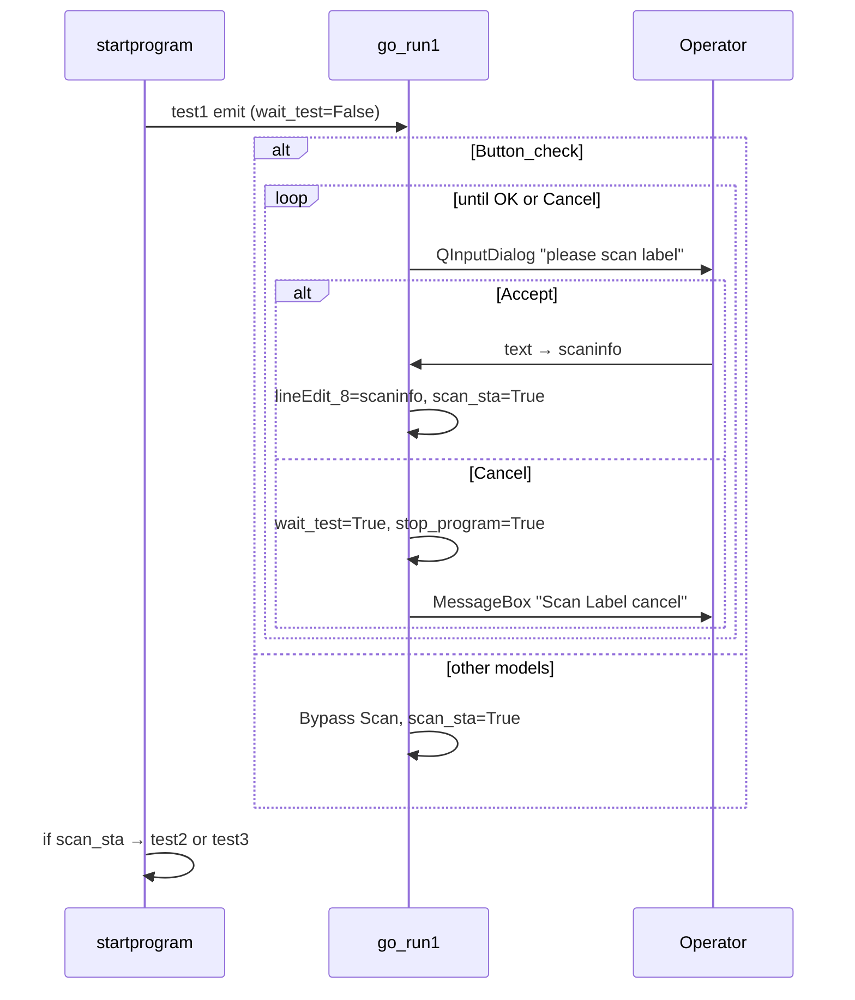
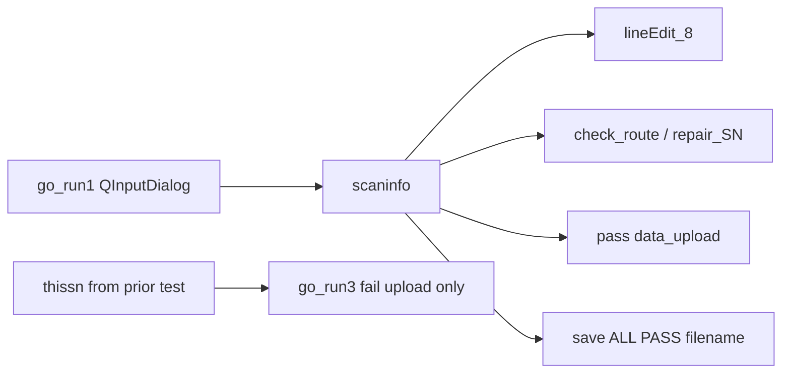

# Pipeline Button_check — `show_image_Button_check`

Dòng: L4220–4377 (`sky.py`). Scan: `go_run1` L737–782. Điều phối: nhánh Button_check `go_run3` L1400–1454. Helper: `get_inference_result` L630, `cambrian_space` L2595, `UI_show` L5235, `updatecount` L415, `resultcolor` L584.

**Không dùng:** pyzbar, PaddleOCR, DataMatrix/`ReadDataMatrixCode`, YOLO, `Runthread`, `barcode_point`, `model_point`, `thissn` (trong vision — nhưng fail upload go_run3 dùng `thissn`).

**Chế độ sensor:** Vision Button_check **không** đến được qua `go_run2` (MR6500 L829). Chỉ `go_run3` manual. Scan trong `go_run1` vẫn chạy ở chế độ sensor, nhưng vision sau trigger sensor là pipeline sai.

**Comment nguồn L4:** `Button_check也一樣，目前僅供驗證` — coi là xác minh/WIP cùng công việc SFIS 8P.

---

## 1. Mục đích

AOI manual một bước cho `select_model=="Button_check"`:

| Phase | Vai trò |
|-------|------|
| **go_run1** | Operator **scan/nhập thủ công SN nhãn** qua `QInputDialog` → `scaninfo` (duy nhất model có scan thật) |
| **go_run3 STEP 1** | Operator xác nhận "Flip the model" → chụp camera → Cambrian trên ROI `ximian` + route/upload SFIS |

| Khía cạnh | Chi tiết |
|--------|--------|
| Bước | 1 (vision); scan là phase điều phối riêng |
| Nguồn SN | **Scan thủ công** (`scaninfo`), không decode ảnh |
| Engine AI | **Chỉ Cambrian** (`get_inference_result` + `cambrian_space`; biến local tên `yolo_step1`) |
| MES | `check_route` / `repair_SN` / pass `data_upload(scaninfo)` trong vision; fail `data_upload(thissn, error=BDFA01)` trong **go_run3** |

### Vì sao Button_check là scan thật duy nhất trong `go_run1`

```736:792:sky.py
    def go_run1(self):
        if self.select_model=="Button_check":
             while True:
                ...
                if input_dialog.exec_() == input_dialog.Accepted:
                    self.scaninfo = input_dialog.textValue()
                    ...
                    self.scan_sta=True
                    break
                else:
                    ...
                    self.wait_test=True
                    self.stop_program=True
                    break
        else:
            logging.info("Bypass Scan")
            ...
            self.scan_sta=True
```

Mọi model khác log **"Bypass Scan"** và đặt `scan_sta=True` không thu SN. Button_check cần SN operator nhập trước vision vì pipeline **không** decode barcode/DataMatrix từ ảnh.

---

## 2. Ánh xạ Dispatch

| select_model | go_run1 | Dòng go_run3 | Pipeline | Bước | Lần chụp | SFIS |
|--------------|---------|-------------:|----------|------:|---------:|------|
| `Button_check` | Scan thật L737 | L1400 | `show_image_Button_check` ×1 | 1 | 1× `get_image` | Vision + fail go_run3 |

Mẫu verify `sample/button_check.jpg` tải L1403 nhưng **không dùng** — sản xuất dùng camera live L1410–1415 (gán `shanshan1` bị comment).

Prompt QMessageBox: `"Please Flip the model"` L1405 (tiêu đề cửa sổ `"warning"` chữ thường).

---

## 3. Luồng Scan trong `go_run1`



| Sự kiện | Cờ / tác dụng phụ |
|-------|-------------------|
| Scan OK | `scaninfo` đặt, `lineEdit_8`, `scan_sta=True` |
| Hủy scan | `wait_test=True`, `stop_program=True` → vòng chính break, Start bật lại |
| OK click rỗng | `scaninfo=""` vẫn chấp nhận — không validate |

**`scaninfo` không reset** khi vào nhánh Button_check (khác WP/Nanook reset `thissn`). Giữ qua chu kỳ cho đến scan thành công tiếp trong `go_run1`.

---

## 4. Caller và Đường Điều khiển

| Caller | Dòng | Điều kiện | Sau return |
|--------|-----:|-----------|--------------|
| `go_run3` | L1421 | Accept prompt Flip (16384) | Kiểm tra `step1` |
| — | L1422–1423 | `step1==True` | `wait_test=True` |
| — | L1425–1448 | `step1==False` | Fail UI, `updatecount`, SFIS fail try/except, `wait_test=True` |
| — | L1450–1454 | Reject prompt Flip (65536) | Xác nhận thoát → `wait_test=True`, `stop_program=True` |

**Chỉ call site** của `show_image_Button_check`.

### `wait_test=True`

| Đường | Dòng | Ghi chú |
|------|-------|-------|
| step1 pass | L1423 | Vision đã Pass + count |
| step1 fail | L1448 | SFIS fail trong try/except L1438–1447 |
| Hủy scan | L780 | `go_run1` + `stop_program` |
| Thoát sau reject Flip | L1453–1454 | — |
| **Reject Flip không xác nhận thoát** | — | **Không reset → treo** |

### `stop_program=True`

| Đường | Dòng |
|------|-------|
| Hủy scan | L781 |
| Xác nhận thoát sau reject Flip | L1454 |

---

## 5. Đầu vào

| Đầu vào | Nguồn | Dùng cho | Bắt buộc? | Rủi ro nếu thiếu |
|-------|--------|----------|-----------|-----------------|
| `scaninfo` | `go_run1` QInputDialog L771 | Route/upload SFIS, `lineEdit_8`, tên lưu | Có | Cũ từ DUT trước nếu bỏ qua go_run1 (chỉ khi bug bypass) |
| `image_numpy` | Camera L1410 | Crop Cambrian | Có | Frame rỗng |
| `stepname` | Chỉ `"STEP 1"` | Cổng nhánh L4225 | Có | No-op nếu sai |
| `point/Button_check_model.json` | Hardcode L4230 | ROI có `"ximian"` trong nhãn | Có | FileNotFound → except; ROI rỗng → Pass rỗng |
| `self.client` | Init Cambrian | `get_inference_result` | Có | Lỗi inference |
| `self.mysfis` | Init SFIS | Route/repair/upload khi `sfis_choose` | Nếu SFIS bật | AttributeError nếu SFIS tắt nhưng vào nhánh route — guard L4245 |
| `self.sfis_choose` | config.json | SFIS vs Cambrian-only offline | Không | Đường offline L4337+ |
| `self.data` | Mẫu CSV L155 | Upload SFIS | Upload | — |
| `self.check_result_OK` | Đặt khối route L4253+ | Cổng Cambrian L4291 | SFIS bật | **Không reset** khi bắt đầu nhánh — cũ từ test SKY/WP trước |
| `self.thissn` | Chỉ test model trước | **fail** upload go_run3 L1441 | Đường fail | **SN sai** — không đặt trong Button_check |
| `barcode_point` / OCR / pyzbar | — | **Không dùng** | — | — |

---

## 6. Đầu ra / Tác dụng phụ

| Tác dụng phụ | Vị trí | Điều kiện |
|-------------|-------|-----------|
| Lưu thô | L4223 | `{img_time}.jpg` (không tiền tố SN) |
| JPG chú thích Cambrian | `cambrian_space` / `UI_show` | Overlay pass/fail |
| Lưu ALL PASS | L4304–4306, L4353–4355 | `{scaninfo}ALL PASS {img_time}.jpg` |
| `lineEdit_8` | L4243, go_run1 L774 | `scaninfo` |
| `lineEdit_9` | Fail go_run3 L1429 | `"Fail"` |
| `resultcolor` + `updatecount` | L4318–4324 (upload SFIS pass OK); L4359–4365 (pass SFIS tắt) | **Chỉ pass trong vision** |
| `step1` | L4326, L4330, L4335, L4370, L4374 | Pass-gated (xem §11) |
| Upload SFIS pass | L4313 `data_upload(scaninfo, data)` | Cambrian Pass + upload `[0]=="1"` |
| Upload SFIS fail | go_run3 L1441 `data_upload(thissn, error=BDFA01)` | step1 fail — **biến SN sai** |
| `wait_test` | Chỉ go_run3 | Không đặt trong vision |
| Log / textbox | Xuyên suốt | Emit route fail dùng **non-f-string** L4250 — literal `{self.deviceshow}` |

---

## 7. Luồng Vision Từng bước

### Điều phối (go_run3 L1400–1454)

1. `step1=False` L1401 — **không** reset `scaninfo`/`thissn`/`check_result_OK`.
2. QMessageBox `"Please Flip the model"`.
3. Accept → `get_image()` → `img_time` → `show_image_Button_check(shan1, "STEP 1")`.
4. Nhánh theo `step1` cho pass/fail/`wait_test`.

### Vision — STEP 1 (`show_image_Button_check` L4220)

1. Lưu frame thô L4223; chuyển **BGR → grayscale** L4224.
2. Tải `point/Button_check_model.json`; mỗi shape có `"ximian"` trong nhãn → crop + vẽ danh sách L4236–4241.
3. `lineEdit_8.setText(scaninfo)` L4243.
4. **SFIS bật** (`sfis_choose==True` L4245):
   - `check_route(scaninfo)` L4247.
   - Return `"0"`: `check_result_OK=False` L4253; `repair_SN(scaninfo)` tùy chọn cho `[LF#:0]` hoặc `[LF#:1]` + `[REPAIR OF AOI take picture]` L4255–4274.
   - Return `"1"`: `check_result_OK=True` L4283.
   - Nếu `check_result_OK`: `get_inference_result(step1_check)` → `cambrian_space(...)` L4295–4298.
     - `"Pass"`: UI_show pass; khi upload SFIS OK → Pass UI + `updatecount` + `step1=True` L4312–4326.
     - Upload `[0]=="0"`: `step1=False` L4328–4330 (không Fail UI/count trong vision).
     - `"Fail"`: `step1=False` L4332–4335.
   - Nếu **không** `check_result_OK`: **bỏ qua** Cambrian; `step1` vẫn False (từ init go_run3).
5. **SFIS tắt** L4337:
   - Log bypass; chỉ Cambrian L4344–4347.
   - Pass → Pass UI + `updatecount` + `step1=True` L4348–4370.
   - Fail → `step1=False` L4371–4374.
   - Khối L4366–4369 `data_upload` là **code chết** (nhánh `sfis_choose==False`).

### Khớp nhãn Cambrian

`cambrian_space` so sánh mỗi inference `category_name` với chuỗi nhãn ROI `cambrian_label_list[i][4]` (phần tử thứ 5 của valuelist). NG hoặc lệch → Fail ROI.

---

## 8. Luồng SN / scaninfo



| Biến | Đặt ở đâu | Dùng ở đâu |
|----------|-----------|------------|
| `scaninfo` | go_run1 L771 | Vision: route, repair, pass upload, lưu, lineEdit_8 |
| `thissn` | **Không bao giờ** trong Button_check | Chỉ fail upload go_run3 L1441 |

**Rủi ro SN cũ:**

- **Fail upload:** dùng `thissn` từ lần chạy SKY/Nanook/WP/Cisco cuối — **lỗi MES nghiêm trọng**.
- **Pass upload:** đúng dùng `scaninfo`.
- **scaninfo cũ:** giảm nhờ scan bắt buộc mỗi chu kỳ go_run1; không reset mỗi nhánh nhưng ghi đè khi scan OK tiếp.
- **scaninfo rỗng:** chấp nhận tại dialog — route/upload chạy với chuỗi rỗng.

---

## 9. Luồng AI / OCR / Barcode

| Công nghệ | Dùng? | Vị trí |
|------------|-------|----------|
| Cambrian (`client.predict_images`) | **Có** | L4295, L4344 qua `get_inference_result` |
| `cambrian_space` overlay/pass-fail | **Có** | L4298, L4347 |
| pyzbar | Không | — |
| PaddleOCR | Không | — |
| DataMatrix / `ReadDataMatrixCode` | Không | — |
| YOLO | Không | — |

SN **100% thủ công** qua dialog scan operator, không decode ảnh.

---

## 10. Luồng SFIS

| Thao tác | SN | Vị trí | Khi nào |
|-----------|-----|----------|------|
| `check_route` | `scaninfo` | L4247 | SFIS bật, trước Cambrian |
| `repair_SN` | `scaninfo` | L4256, L4266 | Route fail + marker repair |
| Pass `data_upload` | `scaninfo` | L4313 | Cambrian Pass + upload thành công |
| Fail `data_upload` | **`thissn`** | go_run3 L1441 | step1 fail — **lỗi** |
| Mã lỗi (fail) | `BDFA01` | L1442 | Cùng họ Cisco/WP/Nanook, **không** SKY `BDFA0` |

### Cổng SFIS đường pass

Khi SFIS bật, `step1=True` chỉ nếu Cambrian Pass **và** `data_upload` trả `[0]=="1"` L4314–4326. Upload fail → `step1=False` → handler fail go_run3 (đếm Fail lần hai + fail upload SN sai).

### SFIS đường fail

go_run3 L1438–1447: **try/except** quanh fail upload — `wait_test=True` dù upload throw (tốt so với mẫu Cisco step2).

### Route fail không Cambrian

Không Pass/Fail UI vision; `step1` vẫn False → khối fail go_run3 chạy một lần.

---

## 11. Tương tác Trạng thái

### `step1` — **pass-gated** (như SKY/Cisco/WP, khác HH4K)

| Kết quả | `step1` | Đặt trong |
|---------|---------|--------|
| Cambrian Pass + upload SFIS OK (SFIS bật) | `True` | Vision L4326 |
| Cambrian Pass (SFIS tắt) | `True` | Vision L4370 |
| Cambrian Fail | `False` | Vision L4335, L4374 |
| SFIS upload NG sau Cambrian Pass | `False` | Vision L4330 |
| Route fail / repair NG / bỏ Cambrian | `False` (ban đầu) | go_run3 L1401 |
| Exception trong vision | `False` (ban đầu) | except L4375 chỉ log |
| `cambrian_space` trả `None` | `False` (ban đầu) | Không nhánh Pass hay Fail |

### Cờ khác

| Cờ | Hành vi Button_check |
|------|----------------------|
| `scan_sta` | True trong go_run1 khi scan OK; xóa trong startprogram sau emit test2/test3 |
| `wait_test` | Xem §4 — treo nếu từ chối Flip không thoát |
| `stop_program` | Hủy scan hoặc xác nhận thoát |
| `check_result_OK` | Không xóa khi vào nhánh — True cũ có thể chạy Cambrian sau route fail |

### Chế độ sensor

| Bước | Button_check + `is_sensor=True` |
|------|-----------------------------------|
| go_run1 | Scan vẫn chạy (dialog thật) |
| go_run2 | Vision **MR6500** L829 — **không** Button_check |
| go_run3 | **Không gọi** |

Sản xuất Button_check **yêu cầu** `is_sensor=False` (chế độ manual).

---

## 12. Đường Thất bại

| Thất bại | Hành vi vision | Hành vi go_run3 | Treo? |
|---------|-----------------|------------------|--------|
| Hủy scan | — | `stop_program` break vòng | Không |
| Reject Flip + thoát Yes | — | `wait_test=True`, `stop_program=True` | Không |
| Reject Flip + thoát No | — | **Không làm gì** | **Có** (`wait_test` False) |
| Route fail (không repair) | Bỏ Cambrian, step1 False | Fail + count + fail upload(`thissn`) | Không |
| Repair NG | Tương tự | Tương tự | Không |
| Cambrian Fail | step1 False, _fail.jpg | Fail + count + fail upload | Không |
| SFIS pass upload NG | step1 False | Fail + count + fail upload | Không |
| Exception vision | Chỉ log, step1 False | Fail + count + fail upload | Không |
| `cambrian_space` None | step1 False | Fail + count | Không |
| Exception upload SFIS fail | — | try/except, `wait_test=True` L1445–1448 | Không |
| ROI `ximian` rỗng | Cambrian Pass rỗng có thể | — | Rủi ro chất lượng |

### Đếm Fail kép

Handler fail go_run3 chạy `updatecount` mọi `step1==False`. Vision **không** tăng Fail khi Cambrian fail (chỉ go_run3) — **một lần đếm** cho vision fail. Exception/route fail: chỉ một lần từ go_run3.

Pass: vision tăng Pass một lần; go_run3 chỉ đặt `wait_test`.

---

## 13. Rủi ro

| Rủi ro | Mức độ | Bằng chứng |
|------|----------|----------|
| Fail upload dùng `thissn` không phải `scaninfo` | **Nghiêm trọng** | go_run3 L1441 vs vision pass L4313 |
| `thissn` không đặt / cũ từ model trước | **Nghiêm trọng** | Không gán trong đường Button_check |
| Chế độ sensor chạy MR6500 không Button_check | **Cao** | go_run2 L829; go_run3 bỏ qua |
| Từ chối "Flip model" không thoát → treo | **Cao** | L1450–1454 chỉ đặt cờ khi xác nhận thoát |
| `check_result_OK` không reset khi vào nhánh | **Cao** | L1401 chỉ reset step1; cũ từ SKY/WP |
| `cambrian_space` except trả `None` | **Cao** | L2643–2645; step1 unset → coi fail go_run3 |
| Exception vision không Fail/count | **Trung bình** | L4375–4377; go_run3 bù |
| Scan rỗng được chấp nhận | **Trung bình** | go_run1 không validate |
| Danh sách ROI rỗng → Pass rỗng | **Trung bình** | `False not in []` → Pass trong cambrian_space L2635 |
| Mã `BDFA01` vs SKY `BDFA0` | **Trung bình** | Mã MES không nhất quán L1442 vs SKY L1150 |
| WIP / chỉ xác minh | **Trung bình** | Comment header L4 |
| Log route fail không nội suy | **Thấp** | L4250 emit non-f-string |
| Upload SFIS chết nhánh SFIS-off | **Thấp** | L4366–4369 không tới được |

---

## 14. Kiểm thử Đề xuất

1. **Pass đầy đủ (SFIS bật):** Scan hợp lệ → accept Flip → Cambrian Pass → upload pass MES với SN **scaninfo**.
2. **Pass đầy đủ (SFIS tắt):** Bypass route → Cambrian Pass → đếm Pass local; không upload.
3. **Hủy scan:** `wait_test=True`, `stop_program=True`, Start bật lại.
4. **Reject Flip không thoát:** Xác nhận treo (`wait_test` False).
5. **Reject Flip có thoát:** `stop_program=True`, vòng thoát.
6. **Route fail:** Không Cambrian; Fail go_run3; SN fail upload = **scaninfo** (kỳ vọng) vs thực tế `thissn`.
7. **Cambrian Fail:** step1 False; một lần Fail count; audit SN fail upload.
8. **SFIS pass upload NG:** step1 False; đường fail go_run3.
9. **Exception upload SFIS fail:** Mock throw → `wait_test=True` (try/except L1445).
10. **Test SKY trước rồi Button_check fail:** Xác minh fail upload không dùng `thissn` SKY.
11. **OK scan rỗng:** Route/upload với chuỗi rỗng.
12. **Thiếu `Button_check_model.json` / không nhãn ximian:** Exception vs Pass rỗng.
13. **Chế độ sensor + recipe Button_check:** Xác nhận MR6500 chạy sau scan (pipeline sai).
14. **Ép exception cambrian_space:** step1 False; fail go_run3 không crash vision.

---

## Tham chiếu Chéo

- Điều phối: `05_runtime_flow.md`, `08_model_dispatch.md`
- Cờ trạng thái: `04_state_machine.md`
- Rủi ro helper Cambrian: `10_risks_and_bugs.md` (cambrian_space None)
- Mẫu route/repair tương tự: `14_sky_pipeline.md`, `17_wp_pipeline.md`
